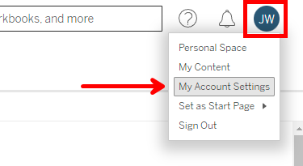
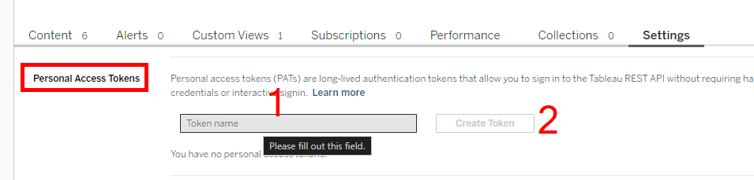
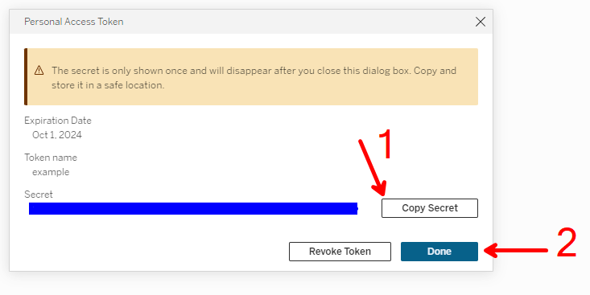

# tc25_ddq_hot
Tableau Conference 2025 Hands On Training - DataDevQuest


[Tableau DataDev slack](https://tabsoft.co/JoinTableauDev)

For this training session, we are going to use python and the Tableau Server
Client (TSC) library.

[Tableau Server Client Documentation](https://tableau.github.io/server-client-python/docs/)

## Installation

```bash
pip install "tableauserverclient>=0.36"
```

## Authentication

Connecting to Tableau Server with the REST API has a few options. Username and 
password is what you might expect to use, but certain Server configurations can
make that difficult. If the Server is configured for Single Sign On (SSO) or 
Multi Factor Authentication (MFA) then username and password will not work. I 
suggest creating a Personal Access Token (PAT) for signing in. 

### Create a Personal Access Token

First, go to your account settings.



Then, create a new Personal Access Token. The server requires you enter a name
to be able to create the token. Be sure to copy your secret key out before 
closing the dialog. You will not be able to see it again.







### Using the Personal Access Token

Now that you have your token name and secret, you will need to use them to
login to the server. I have found using ".env" files to be a good way to keep
secrets out of the code. Here is an example ".env" file that you can use to
store your PAT.

```plaintext
# .env

# Tableau Server
TABLEAU_SERVER=https://10az.online.tableau.com
TABLEAU_PAT_NAME=your-pat-name
TABLEAU_PAT_SECRET=your-pat-secret
```

These secrets can be loaded into your code using the `dotenv` package. Here is
how to install the dotenv package for python.

```bash
pip install python-dotenv
```

Now, we can read in the secrets and use them to login to the server.


## Challenge 1: Finding the workbook

```python
import os 

from dotenv import load_dotenv
import tableauserverclient as TSC

load_dotenv()
```

## Challenge 2: Update the database connection

```python
```

## Challenge 3: Trigger the extract refresh

```python
```

## Challenge 4: Export a PDF

```python
```
